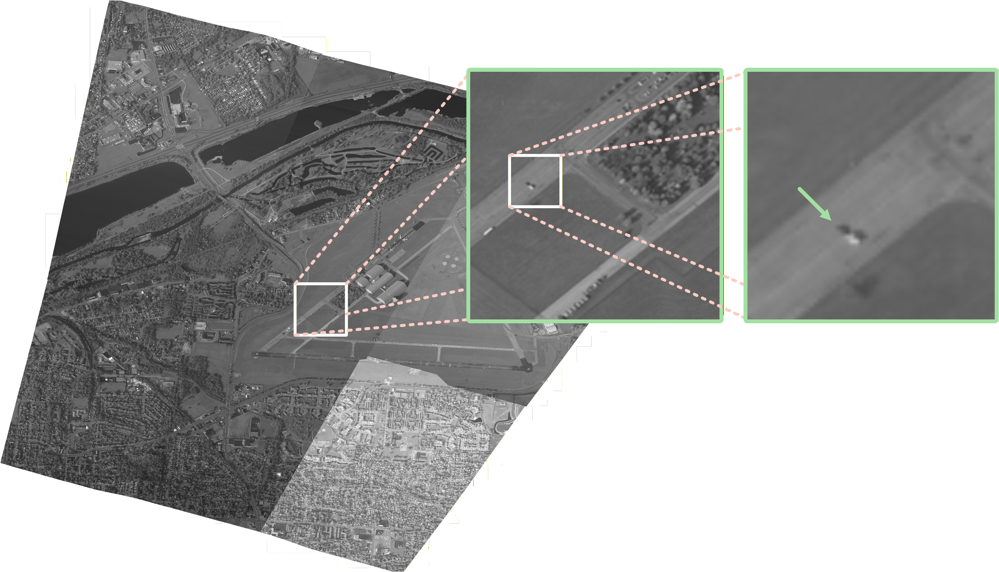
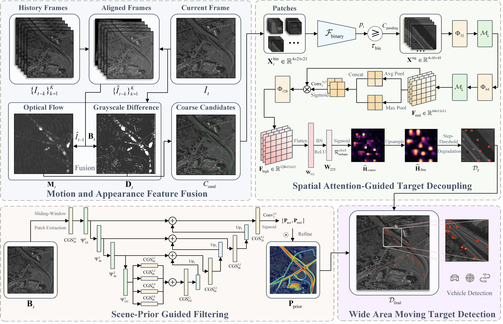
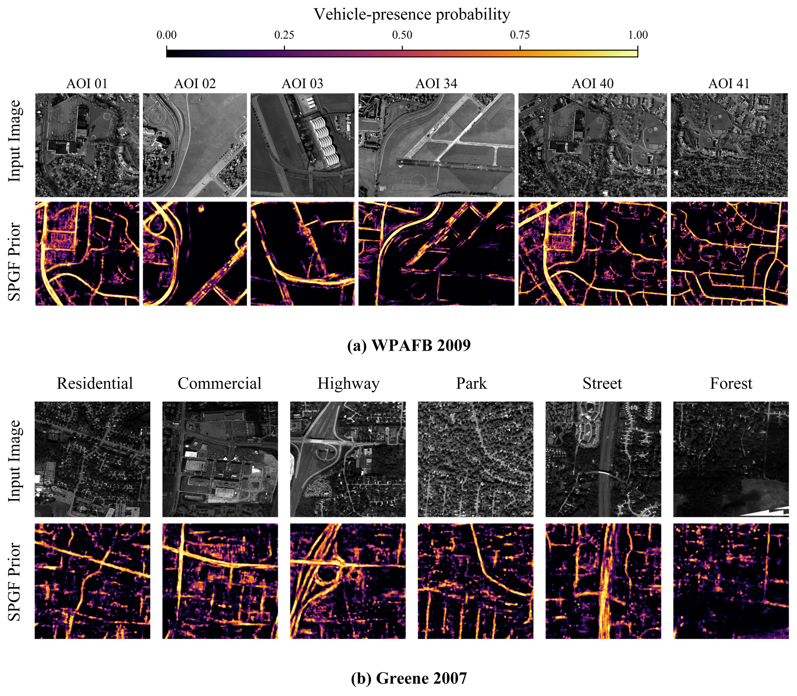

# MDF-Det

MDF-Det is a coarse-to-fine framework for detecting extremely small moving
vehicles in Wide Area Motion Imagery (WAMI). This repository contains the
revised implementation used after peer review, including the native-resolution
SPGF scene-prior module and leakage-controlled cross-AOI training protocol.

Datasets, model weights, cached arrays, and experimental outputs are not stored
in Git.

## WAMI and framework overview





The detector contains three complementary modules:

1. **MAFF:** registers historical frames to the current frame and combines
   temporal background difference with dense optical-flow evidence to generate
   high-recall candidates.
2. **SA-TD:** applies binary classification and spatial-attention heatmap
   regression, followed by threshold-degradation decoding to separate nearby
   targets.
3. **SPGF:** predicts a soft vehicle-presence prior from native-resolution local
   scene appearance and conservatively removes detections in implausible areas.

The revised SPGF does not resize an entire WAMI frame to 256 x 256 and does not
use coordinate channels or absolute positional embeddings. It is trained on
384 x 384 native-resolution patches. Image patches and labels intersecting the
six evaluation AOIs are excluded from training and validation.

### Scene-prior visualization and geographic transfer



The upper panel shows the predicted vehicle-presence prior for the six held-out
WPAFB 2009 AOIs. The lower panel shows zero-shot predictions on Greene 2007:
the SPGF model receives no Greene labels and is not fine-tuned on that dataset.
High responses follow semantically plausible vehicle regions such as roads,
intersections, and parking areas, while most implausible background is
suppressed. These maps are soft priors rather than binary road masks.

## Repository structure

```text
MovingObjectDetector/       Registration, background modelling and CNN refinement
TrainNetwork/               Binary-classification and regression utilities
SPGF/                       Revised scene-prior dataset, model, training and inference
scripts/analysis/           Statistical analysis used in the revision
scripts/figures/            Reproducible publication-figure utilities
WAMI_detector.py            Basic full-frame detector
WAMI_detector_multi_AOI.py  Multi-AOI detector with MAFF, SA-TD and SPGF support
extract_aoi_from_wpafb_nitf.py
compute_metrics*.py         Evaluation utilities
```

## Installation

Python 3.9 is recommended for compatibility with the TensorFlow models used in
the experiments.

```bash
python -m venv .venv
# Windows: .venv\Scripts\activate
# Linux/macOS: source .venv/bin/activate
python -m pip install --upgrade pip
pip install -r requirements.txt
```

NITF/AOI processing additionally requires GDAL and the packages listed in
`requirements-geo.txt`. On Windows, installing GDAL through conda-forge is
recommended.

## Model files

Inference requires model weights that are intentionally not committed. Place
compatible files at locations of your choice and pass them on the command
line. The legacy normalization arrays retained in the repository are:

```text
Models/BinaryClassification/saved_image_norm_2.model
Models/Regression/saved_image_norm_3.model
regression_norm_params.npz
```

Typical external weights are a binary classifier, the spatial-attention
regression model, and `best_semantic_prior_v4.h5`. See [SPGF/README.md](SPGF/README.md)
for generation of the fixed per-AOI prior map.

## Basic detector

```bash
python WAMI_detector.py \
  --InputFolder /path/to/frames \
  --OutputFolder ./WAMI-output \
  --NNModelFolder ./Models \
  --BSThreshold 8 \
  --NumOfTemplate 3
```

## Multi-AOI detector with revised SPGF

Generate `combined_prior.npy` once for a fixed AOI, then reuse it for all
registered frames from that AOI:

```bash
python WAMI_detector_multi_AOI.py \
  --aoi_list 01 \
  --png_root /path/to/aoi_root \
  --truth_csv /path/to/truth.csv \
  --output_base ./WAMI-output \
  --binary_model_dir ./Models \
  --regression_model /path/to/regression_spatial_attention.h5 \
  --regression_norm ./regression_norm_params.npz \
  --use-scene-prior \
  --static-prior-map /path/to/combined_prior.npy
```

Use `python WAMI_detector_multi_AOI.py --help` for the remaining module
switches. The prior can also be produced once inside the detector by supplying
`--full-aoi-prior-model` together with `--full-aoi-prior-context`.

## Paired temporal-block bootstrap

For temporally correlated WAMI frames, the revision uses paired block
resampling rather than treating individual frames as independent samples. Each
method directory must contain `aoi01.json`, ..., `aoi41.json`; every file must
include per-frame `frame`, `tp`, `fp`, and `fn` fields.

```bash
python scripts/analysis/paired_temporal_block_bootstrap.py \
  --mdf-dir /path/to/mdf_results \
  --baseline-dir /path/to/baseline_results \
  --output result/paired_bootstrap \
  --first-frame 612 --last-frame 1124 \
  --block-sizes 10 20 30 --primary-block 20 \
  --resamples 10000 --seed 20260907
```

The script verifies identical per-frame truth counts for both methods, applies
the same sampled temporal blocks to both methods and all AOIs, accumulates
TP/FP/FN before recomputing F1, and reports the confidence interval of the
paired macro-AOI F1 difference.

## Data and weights

The WPAFB/WAMI dataset is not distributed with this repository. To request
dataset access for research use, contact
[likangqiushi20@nudt.edu.cn](mailto:likangqiushi20@nudt.edu.cn).

Do not commit imagery, generated training shards, model checkpoints, cached
priors, or experiment outputs. Publish trained weights separately, for example
as a GitHub Release, and document their checksums.

## Reference

Y. Zhou and S. Maskell, "Detecting and Tracking Small Moving Objects in Wide
Area Motion Imagery (WAMI) Using Convolutional Neural Networks (CNNs)," 2019
22nd International Conference on Information Fusion (FUSION), pp. 1--8,
doi: 10.23919/FUSION43075.2019.9011271.

## License

See [LICENSE](LICENSE).
